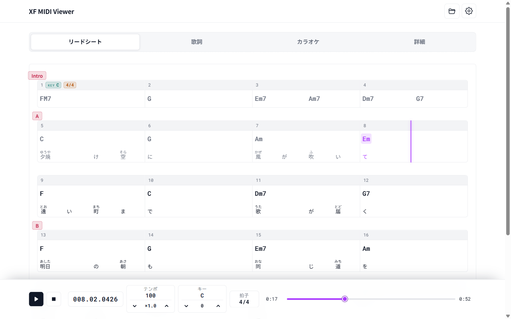

# XF MIDI Viewer

[](https://github.com/oruponu/xf-midi-viewer/blob/main/LICENSE)

YAMAHA XF フォーマット[^1]の MIDI ファイルを再生し、コード進行と歌詞を再生位置に合わせて表示するウェブアプリです。

**公開先**：<https://oruponu.github.io/xf-midi-viewer/>



## 概要

XF MIDI Viewer は、XF フォーマットのデータを読み取り、4 つのビューで表示します。

| ビュー | 表示する内容 |
| --- | --- |
| リードシート | 小節ごとのコード名と歌詞。リハーサルマーク、キー、拍子も並べ、再生済みのコードと歌詞に色を付けます |
| 歌詞 | ルビ付きの歌詞。再生中の歌詞とそのルビを強調します |
| カラオケ | ページ単位の歌詞。再生に合わせて歌詞をワイプし、メロディの音程バーも表示できます |
| 詳細 | ファイルの情報と、XF のデータ（曲情報など）の一覧 |

コード名や歌詞などの表示には、ファイルに含まれるデータを使います。演奏データからコードや歌詞を推定する機能はありません。

再生には、XF MIDI Viewer の内蔵音源か、Web MIDI API で接続した MIDI 機器を使います。テンポは 0.5〜2.0 倍（0.1 刻み）、キーは −6〜+6 半音の範囲で変えられます。

開いたファイルはブラウザの中で読み込み、サーバーには送りません。

## 使い方

1. [公開先](https://oruponu.github.io/xf-midi-viewer/)をブラウザで開きます。
2. MIDI ファイルをページにドラッグ&ドロップするか、「ファイルを選択」から選びます。対応する拡張子は `.mid`、`.midi`、`.kar`、`.xih`、`.xkm` です。
3. 画面上部のタブでビューを切り替えます。
4. 画面下部のプレイヤーで再生します。スペースキーでも再生と一時停止を切り替えられます。

プレイヤーには、再生位置（小節.拍.ティック）と、その位置のテンポ、キー、拍子を表示します。テンポとキーは、倍率と移調を反映した値です。

### 出力先の選択

出力先は、設定画面の「出力」で選びます。設定画面は、右上の歯車アイコンから開きます。初期状態の出力先は内蔵音源です。

**内蔵音源**：ブラウザの中で動くソフトウェアシンセサイザーです。標準で使う SoundFont は、GeneralUser GS に XG のドラムキットと SFX の音色のプリセットを加えたものです。追加したプリセットでは、GeneralUser GS に元からある音色とサンプルを、XG のドラムキットの鍵盤配置と SFX の音色に合わせて割り当てています。新しいサンプルは含みません。

設定画面の「読み込み」で SF2、SF3、DLS 形式のファイルを選ぶと、音色を差し替えられます。選んだファイルはブラウザに保存します。保存できた場合は、次に同じブラウザでページを開いたときも、その音色で再生します。「標準に戻す」を押すと、標準の SoundFont に戻ります。スマホでは、大きな SoundFont を避けてください。

**MIDI 機器**：設定画面の「MIDI許可」を押し、ブラウザで MIDI 機器へのアクセスを許可すると、接続中の出力ポートを選べるようになります。XF MIDI Viewer はファイルに含まれる SysEx メッセージも送るので、ブラウザは SysEx の送信を含めた許可を求めます。

### そのほかの設定

設定画面では、リードシートと歌詞のビューを再生位置に合わせて自動でスクロールするかどうかを切り替えられます。カラオケビューに音程バーを表示するかどうかも、ここで切り替えます。

## 動作環境

内蔵音源と MIDI 機器のどちらに出力する場合も、HTTPS か localhost でページを開く必要があります。公開先は HTTPS で配信しています。

- 内蔵音源を使うには、AudioWorklet に対応したブラウザが必要です。
- MIDI 機器に出力するには、Web MIDI API に対応したブラウザが必要です。
- スマホやタブレットのようにタッチ操作が中心の端末では、内蔵音源での再生中に別のタブやアプリへ切り替えると一時停止します。それ以外の端末では一時停止しません。

## 開発

React と TypeScript で書き、Vite でビルドしています。内蔵音源には [SpessaSynth](https://github.com/spessasus/spessasynth_lib) を使っています。

### 必要なもの

- [Bun](https://bun.sh/)

### セットアップ

```bash
git clone https://github.com/oruponu/xf-midi-viewer.git
cd xf-midi-viewer
bun install
bun run dev
```

`bun run dev` と `bun run build` は、Vite を起動する前に次の 2 つのファイルを生成します。どちらもリポジトリには含めていません。

- `public/third-party-licenses.txt`：使用しているライブラリのライセンス一覧
- `public/soundfonts/GeneralUser-GS-XG.sf3`：`assets/soundfonts/GeneralUser-GS.sf3` に、XG のドラムキットと SFX の音色のプリセットを加えた SoundFont

### スクリプト

| コマンド | 内容 |
| --- | --- |
| `bun run dev` | 開発サーバーを起動します |
| `bun run dev:https` | HTTPS の開発サーバーを、同じネットワークの他の端末からも開けるように起動します。証明書は自己署名です |
| `bun run build` | 型チェックをしてから `dist/` にビルドします |
| `bun run preview` | ビルドした結果をローカルのサーバーで開きます |
| `bun run test` | テストを実行します |
| `bun run lint` | ESLint でコードを検査します |

### スマホでの確認

内蔵音源は HTTPS か localhost で開いたページでしか動かないため、スマホから開発サーバーに接続するときは `bun run dev:https` を使います。PC でこのコマンドを実行し、同じネットワークにあるスマホで `https://<PC の IP アドレス>:5173/` を開きます。証明書は自己署名なので、ブラウザが警告を表示します。警告を承認して進むと、ページが開きます。

### 公開

`main` ブランチにプッシュすると、GitHub Actions がテストとビルドを実行し、GitHub Pages に公開します。

## ライセンス

ソースコードは [MIT License](https://github.com/oruponu/xf-midi-viewer/blob/main/LICENSE) で公開しています。

内蔵音源の SoundFont は、S. Christian Collins 氏の [GeneralUser GS](https://schristiancollins.com/generaluser.php) にプリセットを加えたもので、GeneralUser GS のライセンスに従います。ライセンスの全文と、元にしたファイルの入手元は [`public/soundfonts/GeneralUser-GS-LICENSE.txt`](public/soundfonts/GeneralUser-GS-LICENSE.txt) にあります。

使用しているライブラリのライセンス一覧は、アプリの設定画面の「ライセンス」から開けます。

[^1]: XF フォーマットは、ヤマハが定めた SMF（Standard MIDI File）の拡張仕様です。歌詞、コード名、曲名や作曲者などの曲情報を SMF に格納できます。XF MIDI Viewer は個人が開発しているソフトウェアで、ヤマハ株式会社とは関係ありません。
